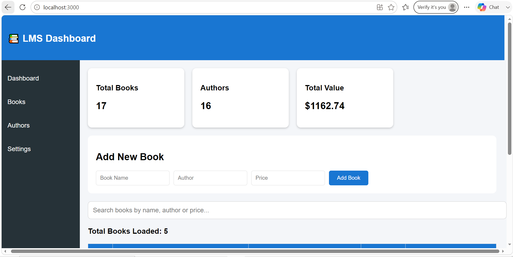
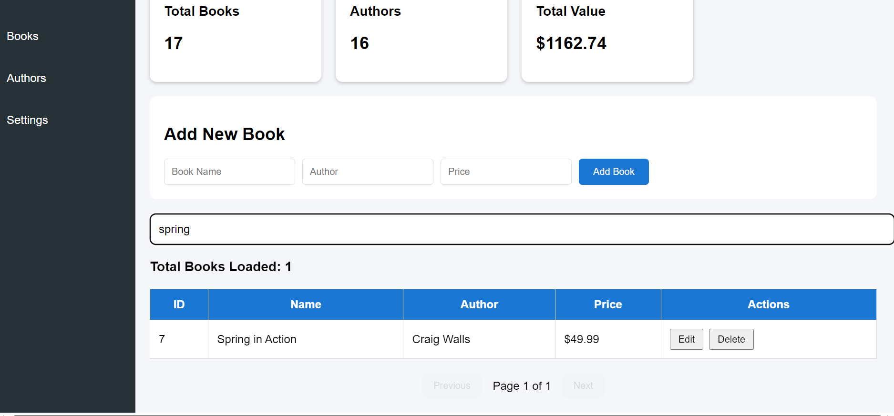
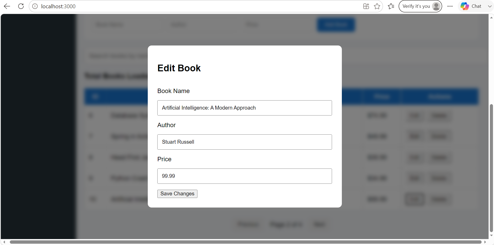
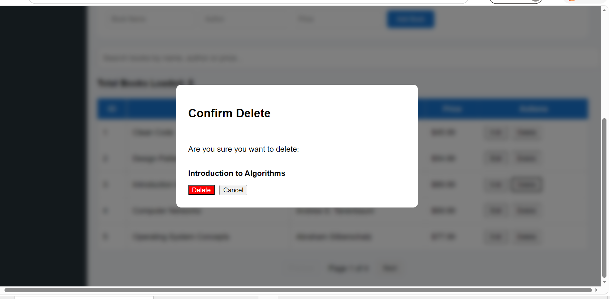
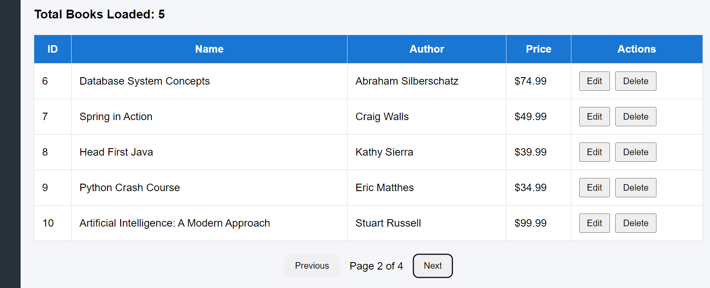

# Library Management System

A full-stack Library Management System built using React, Spring Boot, MyBatis and SQLite.

## Features

- Add Books
- Edit Books
- Delete Books
- Search Books
- Pagination
- Dashboard Analytics
- Toast Notifications
- Loading Spinner
- Edit Modal
- Delete Confirmation Modal

## Tech Stack

### Frontend
- React
- Axios
- React Toastify

### Backend
- Spring Boot
- MyBatis
- SQLite

## Project Structure

library-management-system-fullstack

├── backend (Spring Boot API)

├── frontend (React UI)

└── screenshots
   
   ## Screenshots

### Dashboard



### Search



### Edit Modal



### Delete Modal



### Pagination



## Installation

### Backend

Run Spring Boot application.

### Frontend

```bash
npm install
npm start
```

## Author

JAMSON J.Lewis
